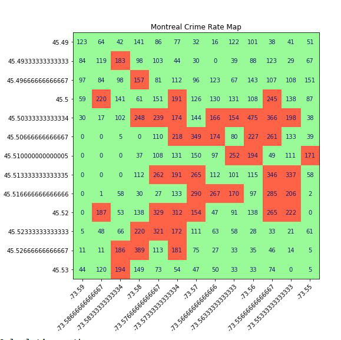
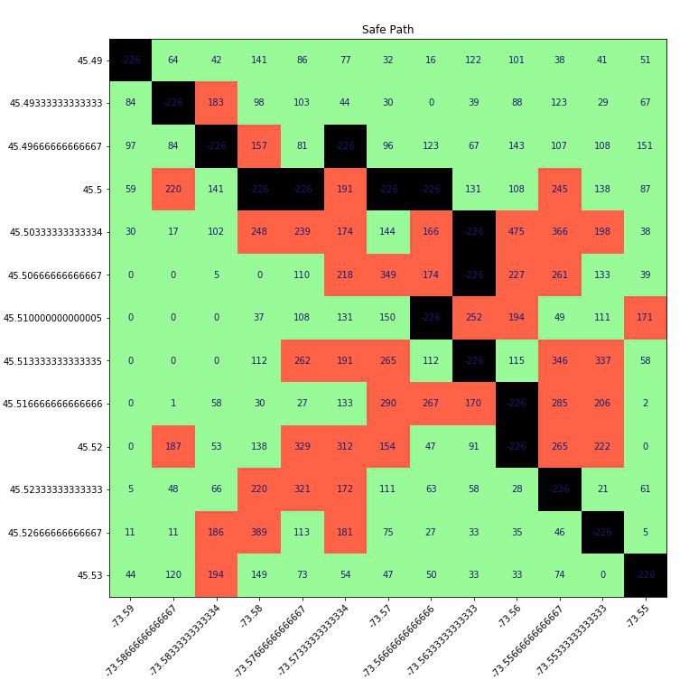

# Montreal-Path-Finder

## Introduction
* An application that finds a path through the crime-free areas in Montreal city for safe travelling. 
* Analyses high crime areas in Montreal to provide a safe path between two coordinates on the map using A* heuristic algorithm.

## Libraries Used
* [numpy](https://numpy.org/)
* [Matplotlib](https://matplotlib.org/)
* [Shapefile](https://pypi.org/project/pyshp/#the-reader-class)
* [statistics](https://docs.python.org/3/library/statistics.html)

## Screenshots

## Running instructions
* Run mainfile.py
* Follow prompts

## Future Scope
* Get red zone alerts using live location
* Live path
* GUI
